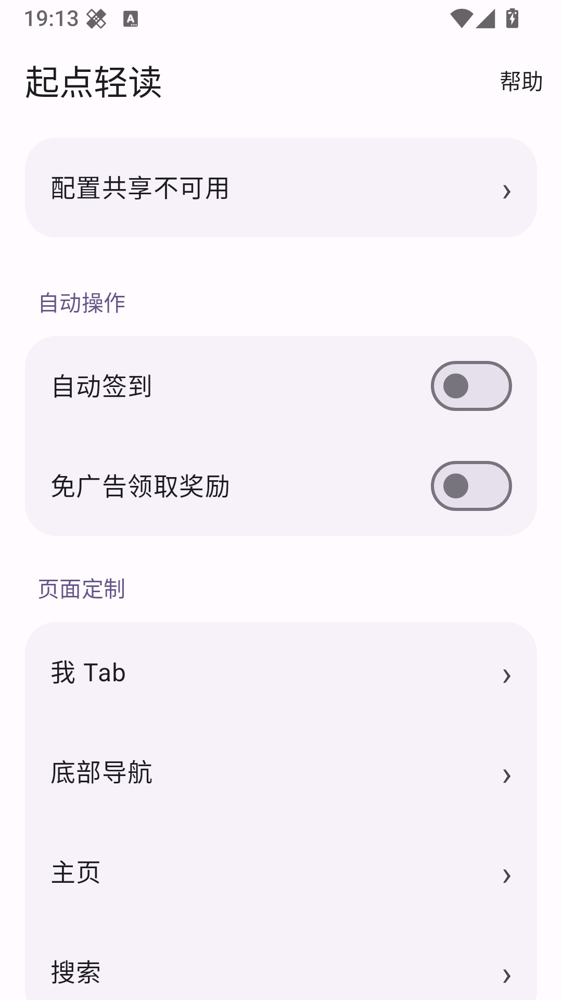

# 起点轻读 · QDReadHook

[](https://www.android.com)
[](../../releases)
[](../../releases)

起点阅读 Xposed / LSPosed 增强模块：签到与奖励辅助、界面定制、内容净化，内置 Material You 设置页，全部功能按需开关。

> ⚠️ 当前适配起点 **7.9.428 / 1706**。宿主版本更新后需重新核对混淆类与方法签名，部分功能可能失效。



## ✨ 功能

- **自动操作** — 自动签到、免广告领取奖励辅助（DexKit 定位，带失败回退）
- **页面定制** — 「我」Tab 菜单、底部导航、主页选项、搜索分组，自由隐藏不需要的入口
- **阅读体验** — 章评原图入口、图片地址弹框、音频导出 / 复制地址、评论复制、章末模块隐藏、会员卡背景展示调整
- **内容净化** — 小红点去除、11 项广告拦截、15 项拦截选项
- **高级设置** — 自定义宿主包名，多选项目按需启用

新功能默认关闭，需在设置页手动开启。

## 📦 安装与使用

1. 在 [Releases](../../releases) 下载最新 APK 并安装。
2. 在 LSPosed 中启用模块，并将起点阅读加入作用域。
3. 打开「起点轻读」设置页，按需开启功能。
4. 「我」Tab 与底部导航：先由起点上报菜单目录，再在子页勾选隐藏项（导航目录需开启自定义底部导航并重启起点）。
5. 多选页点击「保存」后生效；修改设置后手动重启起点。

> **注意：GDT 广告拦截会停用广点通初始化，可能影响原生视频奖励回退，默认不勾选。**

## 🛠️ 构建

| 项目 | 版本 |
| --- | --- |
| JDK | 21 |
| Gradle / AGP / Kotlin / KSP | 8.7 / 8.5.2 / 1.9.22 / 1.9.22-1.0.17 |
| compileSdk / targetSdk / minSdk | 33 / 32 / 24 |

主要依赖：YukiHookAPI 1.0.92、DexKit 2.0.3、Material Components、AndroidX Preference。

```powershell
.\gradlew.bat :app:assembleDebug --no-daemon --console=plain --max-workers=4
```

产物位于 `app/build/outputs/apk/debug/app-debug.apk`。SDK 路径在 `local.properties`，私有签名配置在 `keystore.properties`（不存在时使用标准 Debug 签名）。

## 📁 项目结构

```
app/src/main/java/cn/xihan/qdds/
├── HookEntry.kt            # 模块入口与初始化
├── MainActivity.kt         # MD3 设置主页
├── OptionEditor.kt         # 多选项目编辑
├── SettingsViews.kt        # 设置界面组件
├── MeTabCatalogProvider.kt # 受限菜单目录上报
└── hooks/                  # 按功能划分的 Hook 实现
    ├── AdBlockHook.kt          # 广告拦截
    ├── AutoSignHook.kt         # 自动签到
    ├── ChapterCommentHook.kt   # 章评增强
    ├── ChapterEndHook.kt       # 章末模块隐藏
    ├── HomeSearchHook.kt       # 主页 / 搜索定制
    ├── InterceptHook.kt        # 通用拦截
    ├── HookStartup.kt          # 启动期安装（后台 DexKit，防 ANR）
    ├── HookMethodCache.kt      # 方法定位缓存
    └── HookSupport.kt          # 安全日志与工具
```

## ⚙️ 实现说明

- 界面 Hook 仅安装在宿主主进程；子进程直接跳过。
- 启动时先安装明确目标与缓存目标，未缓存的定位任务在首帧后由单一后台线程补查，主线程不等待 DexKit，避免启动 ANR。
- 方法缓存存于宿主私有目录，校验宿主版本、APK 身份与规则版本，失效后自动后台补查。
- 菜单隐藏仅交换菜单标题，不触碰账户信息与未读计数；宿主无法改写设置与隐藏名单。
- 章评音频导出至 `Music/QDReader`（Android 10+ 走 MediaStore）。

## ❓ 常见问题

**功能开了没效果？**
确认模块已在 LSPosed 启用、起点在作用域内，且修改设置后重启了起点。宿主版本不在适配范围内时，部分 Hook 会静默失效。

**首次启动后部分拦截没生效？**
首次无缓存时，启动期拦截可能赶不上本次调用，属预期行为；后台定位完成后重启即可。

**Android 13 单色主题？**
图标已适配单色层，但未做对应系统的真机验证。

## 📄 其他

本项目仅供学习交流使用，请于下载后 24 小时内删除。
